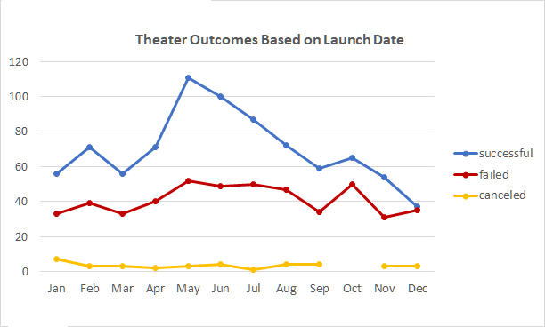
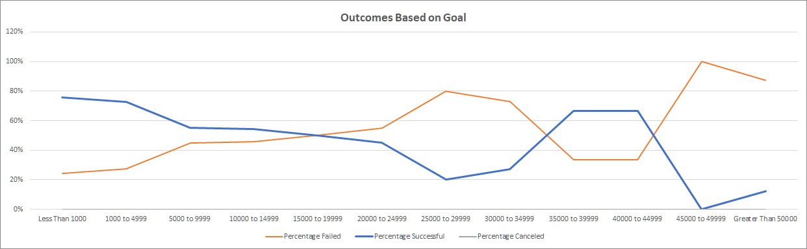

# Kickstarting with Excel

## Overview of Project

### To inform Louise on how campaign outcomes can differ in correlation with campaign factors, this project investigated the outcomes in relation to their launch dates and their funding goals. To tailor the investigation according to Louise's campaign category, launch dates were investigated for only the "theater" category and funding goals were investigated for only the "plays" subcategory.
 

## Analysis and Challenges

### Analysis of Outcomes Based on Launch Date
 

  

The number of successful campaigns peaks in May and then starts to decrease through June and July. It is back to the baseline level in August. It is worth noting that campaigns launched in December are below the baseline for success. On the other hand, the numbers of failed and canceled campaigns do not vary significantly with the month. Therefore, to launch a theater campaign in May, or June and July, is recommended.
 
 

### Analysis of Outcomes Based on Goals

The successful percentage of campaigns in the "plays" subcategory was further investigated based on their funding goals.
 

| Goal |	Number Successful |	Number Failed  |	Total Projects	| Percentage Successful |	Percentage Failed |	
|---|:---:|:---:|:---:|:---:|:---:|
|Less Than 1000 |	    141|	    45|		186|	76%|	 24%|
|1000 to 4999 |	        388|       146|     534|	73%|	 27%|
|5000 to 9999 |	         93|	    76|		169|	55%|	 45%|	
|10000 to 14999 |	     39|	    33|	     72|    54%|	 46%|	
|15000 to 19999 |        12|	    12|	     24|	50%|	 50%|	
|20000 to 24999 |	      9|        11|	     20|	45%|	 55%|	
|25000 to 29999 |	      1|	     4|	      5|	20%|	 80%|
|30000 to 34999 |	      3|	     8|	     11|	27%|	 73%|
|35000 to 39999 |	      4|	     2|	      6|	67%|	 33%|
|40000 to 44999 |	      2|	     1|	      3|	67%|	 33%|
|45000 to 49999 |	      0|	     1|	      1|	 0%|	100%|	
|Greater Than 50000 |	  2|	    14|	     16|	13%|	 88%|

It is noticed that the number of Total Projects is small when the goal is greater than 15000, especially when the goal is greater than 25000. Therefore, any observation made from this range should be cross-checked carefully due to lack of samples.
 
 

Below is the plot of successful and failed percentage in relation to campaign goals.
 
 

 
 
 

For campaign goals less than 25000, the successful percentage decreases monotonically with campaign goal. The successful percentage is higher than 70% when the campaign goal is less than 5000. When the campaign goal becomes greater than 5000, the successful percentage immediately drops by about 20%.
 
 

### Challenges and Difficulties Encountered

When analyzing Outcomes Based on Goal, the successful percentage increases dramatically for goals between 35000 and 45000. However, this observation is probably false due to small sample size. Recommendation to Louise should exclude this observation until concrete evidence becomes available.
 
 

## Results

- What are two conclusions you can draw about the Outcomes based on Launch Date?
     
     
    One conclusion that can be drawn is that the number of successful campaigns peaks for launch dates in May and remains higher than baseline until July. As contrary, it is the lowest in December. 
     
     
    The second conclusion is that the number of failed campaigns does not correlate to the month. However, factors other than the month may cause failed campaigns and therefore should be investigated. 
     
     

- What can you conclude about the Outcomes based on Goals?
     
     
    The outcomes decreases with increasing campaign goals. 
     
     

- What are some limitations of this dataset?
     
     
    The sample size is too small for certain subset of data to draw concrete conclusions.
     
     

- What are some other possible tables and/or graphs that we could create?
     
     
    When evaluating the campaign outcomes, the ratio between "pledged" and "goal" can be a better method than simply classifying the outcome as "success" or "failed". The pledged-to-goal ratio may provide more granularity for the analysis.
     
     
    Additionally, the campaign duration and its correlation with launch dates and campaign goals might be informative for Louise.
